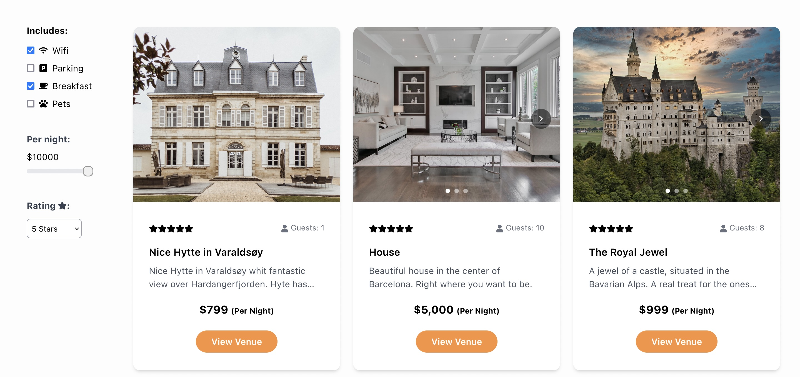

[](https://app.netlify.com/sites/pe-2-holidaze/deploys)

# Project Exam 2 - Holidaze




## Required Links

- [Kanban project board (GitHub projects)](https://github.com/users/e0402/projects/4)
- [Gantt chart (GitHub projects)](https://github.com/users/e0402/projects/4/views/4?layout=roadmap)
- [Style guide (Adobe XD)](https://xd.adobe.com/view/4918c744-bf2b-4c18-b700-38a1569ae3d2-1c4b/)
- [Application design (Adobe XD)](https://xd.adobe.com/view/1e6b2ffc-4cdd-4cd4-93b6-54cd55cf4cd9-4b38/)
- [Application demo (Netlify)](https://pe-2-holidaze.netlify.app/)

# Semester Project brief

## Goal

To take the skills learned over the last two years and take on an extensive project where the finished product should reflect the candidate’s general development capabilities, in addition to visual and technical skills.

## Brief

A newly launched accommodation booking site called Holidaze has approached you to develop a brand new front end for their application. While they have a list of required features, the design and user experience has not been specified. Working with the official API documentation, plan, design and build a modern front end accommodation booking application.

There are two aspects to this brief: the customer-facing side of the website where users can book holidays at a venue, and an admin-facing side of the website where users can register and manage venues and bookings at those venues.

**Clone the repo to your local computer:**

```
https://github.com/e0402/project-exam-2.git
```

**Install all dependencies:**

```
npm install
```

**Run the app:**

```
npm start
```

## Dependencies

- [React](https://reactjs.org/) - A JavaScript library for building user interfaces.
- [React DOM](https://reactjs.org/docs/react-dom.html) - Serves as the entry point to the DOM and server renderers for React.
- [React Router DOM](https://reactrouter.com/web/guides/quick-start) - Used for routing on client side.
- [Formik](https://formik.org/) - Helps simplify form building in React.
- [Yup](https://github.com/jquense/yup) - A JavaScript schema builder for value parsing and validation.
- [Swiper](https://swiperjs.com/) - Used for implementing slider functionality.

### UI Components and Icons

- [React Icons](https://react-icons.github.io/react-icons/) - An Icon library.
- [React Modal](https://github.com/reactjs/react-modal) - A React modal component.
- [React Datepicker](https://reactdatepicker.com/) - A React datepicker component.

### Development Tools

- [Tailwind CSS](https://tailwindcss.com/) - A utility-first CSS framework for UI development.
- [ESLint](https://eslint.org/) - A JavaScript linter.
