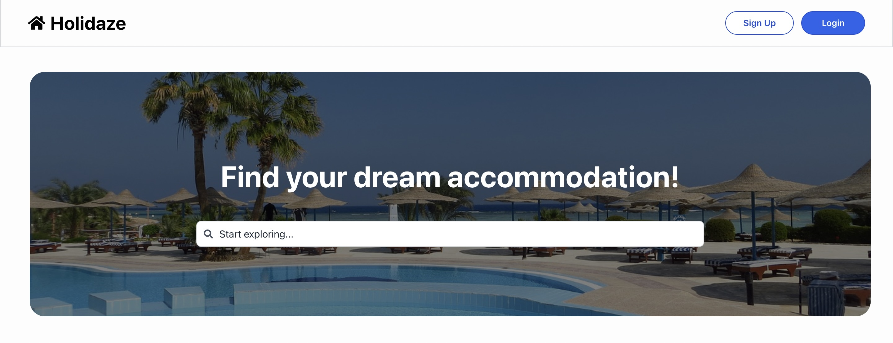

# Project Exam 2 - Holidaze




## Required Links

- [Kanban project board (GitHub projects)](https://github.com/users/e0402/projects/4)
- [Gantt chart (GitHub projects)](https://github.com/users/e0402/projects/4/views/4?layout=roadmap)
- [Style guide (Adobe XD)](https://xd.adobe.com/view/4918c744-bf2b-4c18-b700-38a1569ae3d2-1c4b/)
- [Application design (Adobe XD)](https://xd.adobe.com/view/1e6b2ffc-4cdd-4cd4-93b6-54cd55cf4cd9-4b38/)
- [Application demo (Netlify)](https://best-bargain.netlify.app/)

# Semester Project brief

## Goal

To take the skills learned over the last two years and take on an extensive project where the finished product should reflect the candidate’s general development capabilities, in addition to visual and technical skills.

## Brief

A newly launched accommodation booking site called Holidaze has approached you to develop a brand new front end for their application. While they have a list of required features, the design and user experience has not been specified. Working with the official API documentation, plan, design and build a modern front end accommodation booking application.

There are two aspects to this brief: the customer-facing side of the website where users can book holidays at a venue, and an admin-facing side of the website where users can register and manage venues and bookings at those venues.

**Clone the repo to your local computer:**

```
https://github.com/e0402/Semester-Project-2.git
```

**Install all dependencies:**

```
npm install
```

**Run the app:**

```
npm start
```

## Built using

- React
- Tailwind
